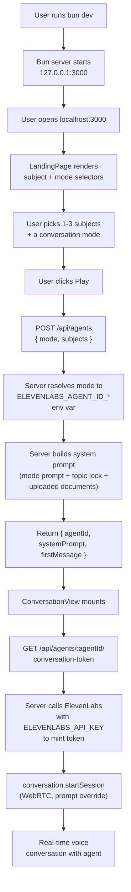

# PODU Application Flow

## Overview

## Server Routes

| Route | Method | Purpose |
|-------|--------|---------|
| `/api/agents` | POST | Resolve a mode + subjects to an `agentId` + system prompt |
| `/api/agents/:agentId/conversation-token` | GET | Mint a short-lived WebRTC token from ElevenLabs |
| `/api/documents` | GET, POST | List / upload knowledge-base documents (in-memory) |
| `/api/documents/:id` | GET, DELETE | Read / delete a document |
| `/api/health` | GET | Health check |
| `/frontend.tsx` | GET | Bun-transpiled React entry point |
| `/*` | GET | Static assets or fallback HTML |

## Environment Variables

Set in `.env` (see `.env.example`):

| Variable | Purpose |
|----------|---------|
| `ELEVENLABS_API_KEY` | Server-side ElevenLabs API key (used to mint conversation tokens) |
| `ELEVENLABS_AGENT_ID_FUN` | Agent ID for "fun" mode |
| `ELEVENLABS_AGENT_ID_EDU` | Agent ID for "educational" mode |
| `ELEVENLABS_AGENT_ID_DEEP` | Agent ID for "deep" mode |
| `HOST` (optional) | Bind host, default `127.0.0.1` |
| `PORT` (optional) | Bind port, default `3000` |

The API key stays on the server. The browser receives only short-lived conversation tokens.
