# PODU Application Flow Diagram

## Complete Application Flow

```mermaid
graph TD
    subgraph ServerStartup["Server Startup (Bun)"]
        Start["Start Server<br/>src/index.ts"]
        LoadEnv["Load Environment Variables<br/>VITE_CLERK_PUBLISHABLE_KEY"]
        CacheHTML["Cache HTML Template<br/>src/index.html"]
        InitRoutes["Initialize API Routes<br/>/api/agents, /api/documents, etc."]
    end

    subgraph BrowserRequest["Browser Request"]
        Request["User navigates to<br/>http://localhost:3000"]
        GetHTML["GET /"]
        GetTSX["GET /frontend.tsx"]
    end

    subgraph ServerResponse["Server Response"]
        TranspileTSX["Transpile frontend.tsx<br/>using Bun.build<br/>with VITE_CLERK_PUBLISHABLE_KEY"]
        ServeHTML["Serve HTML"]
        ServeJS["Serve transpiled<br/>JavaScript with env var"]
    end

    subgraph BrowserExecution["Browser Execution"]
        ParseHTML["Parse HTML"]
        LoadModule["Load frontend.tsx module"]
        ExecuteJS["Execute transpiled JS"]
    end

    subgraph ReactInit["React Initialization"]
        ReadKey["Read import.meta.env<br/>.VITE_CLERK_PUBLISHABLE_KEY"]
        InitClerk["Initialize ClerkProvider<br/>with publishable key"]
        MountApp["Mount React App"]
    end

    subgraph AuthFlow["Authentication Flow"]
        CheckAuth["Clerk checks auth state"]
        SignedIn{"User<br/>Signed In?"}
        ShowWelcome["Show WelcomePage<br/>SignInButton, SignUpButton"]
        ShowLanding["Show LandingPage<br/>SubjectSelector, ModeSelector"]
    end

    subgraph UserInteraction["User Interaction Flow"]
        SelectSubjects["User selects subjects<br/>(1-3 subjects)"]
        SelectMode["User selects mode<br/>(edu, casual, etc.)"]
        ClickPlay["User clicks Play button"]
        ValidateSelection{"At least 1<br/>subject selected?"}
        CallAPI["POST /api/agents<br/>{ mode, subjects }"]
        GetAgentId["Receive agentId"]
        ShowConversation["Show ConversationView<br/>with agentId"]
    end

    subgraph ConversationFlow["Conversation Flow"]
        GetSignedURL["GET /api/agents/:agentId/signed-url"]
        StartConversation["Start conversation<br/>with ElevenLabs"]
        UserInteracts["User interacts with<br/>podcast agent"]
    end

    Start --> LoadEnv
    LoadEnv --> CacheHTML
    CacheHTML --> InitRoutes
    InitRoutes --> Request
    Request --> GetHTML
    GetHTML --> ServeHTML
    ServeHTML --> ParseHTML
    ParseHTML --> GetTSX
    GetTSX --> TranspileTSX
    TranspileTSX --> ServeJS
    ServeJS --> LoadModule
    LoadModule --> ExecuteJS
    ExecuteJS --> ReadKey
    ReadKey --> InitClerk
    InitClerk --> MountApp
    MountApp --> CheckAuth
    CheckAuth --> SignedIn
    SignedIn -->|No| ShowWelcome
    SignedIn -->|Yes| ShowLanding
    ShowWelcome -->|User signs in| CheckAuth
    ShowLanding --> SelectSubjects
    SelectSubjects --> SelectMode
    SelectMode --> ClickPlay
    ClickPlay --> ValidateSelection
    ValidateSelection -->|No| SelectSubjects
    ValidateSelection -->|Yes| CallAPI
    CallAPI --> GetAgentId
    GetAgentId --> ShowConversation
    ShowConversation --> GetSignedURL
    GetSignedURL --> StartConversation
    StartConversation --> UserInteracts
```



## Key Components

### Server Side (`src/index.ts`)
- **Environment Variables**: Loads Clerk publishable key from `VITE_CLERK_PUBLISHABLE_KEY` (official Clerk pattern)
- **TSX Transpilation**: Uses `Bun.build` to transpile `frontend.tsx` to JavaScript, injecting `VITE_CLERK_PUBLISHABLE_KEY` via `define` option
- **API Routes**: Handles `/api/agents`, `/api/documents`, etc.

### Client Side (`src/frontend.tsx`)
- **Clerk Initialization**: Reads `import.meta.env.VITE_CLERK_PUBLISHABLE_KEY` (official Vite/Bun pattern) and initializes `ClerkProvider`
- **React Mounting**: Mounts the React app with Clerk authentication wrapper

### App Component (`src/App.tsx`)
- **Auth Routing**: Uses Clerk's `SignedIn`/`SignedOut` components to show different views
- **WelcomePage**: Shown when user is signed out (sign in/sign up buttons)
- **LandingPage**: Shown when user is signed in (subject selection, mode selection, play button)

### Landing Page (`src/components/LandingPage.tsx`)
- **Subject Selection**: User selects 1-3 subjects
- **Mode Selection**: User selects conversation mode (edu, casual, etc.)
- **Start Conversation**: Calls `/api/agents` to get agentId, then shows ConversationView

## Data Flow

1. **Server → Browser**: HTML template
2. **Browser → Server**: Request for `/frontend.tsx`
3. **Server → Browser**: Transpiled JavaScript (with `VITE_CLERK_PUBLISHABLE_KEY` injected via `define`)
4. **Browser**: Executes JS, reads `import.meta.env.VITE_CLERK_PUBLISHABLE_KEY`, initializes Clerk, mounts React
5. **Browser → Clerk**: Authentication check
6. **Clerk → Browser**: Auth state (signed in/out)
7. **Browser**: Renders appropriate view based on auth state
8. **Browser → Server**: API calls for agents, documents, etc.

## Environment Setup

Set the following in `.env.local` (recommended) or `.env`:

```bash
VITE_CLERK_PUBLISHABLE_KEY=YOUR_PUBLISHABLE_KEY
```

Get your Publishable Key from the [Clerk Dashboard](https://dashboard.clerk.com/last-active?path=api-keys).

For more information, see the [Clerk React Quickstart](https://clerk.com/docs/quickstarts/react).
